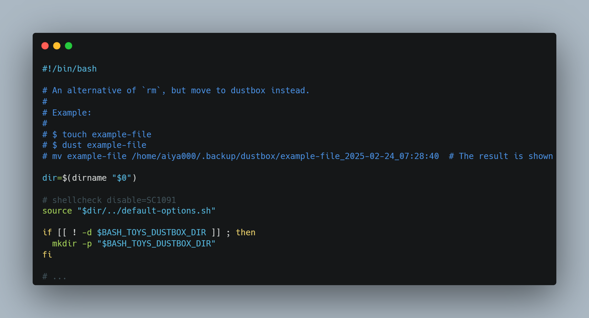

# :dog2: bash-toys :dog2:

Welcome to **bash-toys**!



## Overview

**bash-toys** is "Tiny Tools that Reach the Finer Details". It's a collection of shell scripts and aliases for bash/zsh designed to simplify your life and make your terminal experience more enjoyable.

**No Dependencies.**

**Nothing complicated.**

## Scripts

### Bin

'bin' are utility scripts, can run as a child process (in a sub shell).

- `dust`: An alternative to `rm`, moving files to a dustbox instead. Similar to [gomi](https://github.com/babarot/gomi), but with no dependencies (no Golang required).
- `which-bin`: A shorthand for `cat $(which cmd)`. Automatically uses [bat (batcat)](https://github.com/sharkdp/bat) instead of `cat` if available.
- `start`: A shorthand for `"$@" > /dev/null 2>&1 &`. Starts a process in background without outputs. This is often useful to run GUI applications from CLI
- `pomodoro-start`: A basic CLI Pomodoro timer implementation in shell script.
- `git-root` Shows a git root directory of a current directory. This is a shorthand for `git rev-parse --show-toplevel 2> /dev/null || return 1`
- `vim-configure`: Executes `./configure` for Vim source with modern flags. Requires some packages. See https://vim-jp.org/docs/build_linux.html for details.
- `vim-configure-debug`: Executes `./configure` for Vim source for testing purposes. Requires some packages. See https://vim-jp.org/docs/build_linux.html for details.

### Functions

'functions' are utility scripts that effects the parent shell.
In simple terms, it is like the cd command, etc.

- `define-alt`: Defines a shell variable of name 'foo' if 'foo' variable is not defined
- `define-alt-export`: Simular to `define-alt`, but this defines environment variables
- `force-unexport`: Unexport an environment variables
- `cd-finddir`: Shows all directories of 6 depth (if `fd` is available, or 3 depth for `find`), and cd to a directory you selected
- `cd-to-git-root`: `cd` to the git root directory (With `wslpath` support. Try using `wslpath`. This is often useful if you are in a git directory of Windows filesystem)
- `cd-to-node-root`: Simular to `cd-to-git-root`, but this try to find `package.json`. This is often useful for bun/npm workspaces
- `contains_value`: A simple utility that does an array contains a value or not
- `alias_of`: Creates an alias and overwrite a taken name if you have a specified command (e.g. `alias_of mysql 'mysql --pager="less -r -S -n -i -F -X"'` this defines mysql alias only if you have mysql command)
- `source_if_exists`: `source` if a specified script does exist

- - -

For a complete list of scripts, please visit [./bin](https://github.com/aiya000/bash-toys/tree/main/bin) and [./functions](https://github.com/aiya000/bash-toys/tree/main/functions).

## Show help for commands

Just we can use `which-bin`!

For example:
- bin: `$ which-bin {cmd-name}`, e.g. `$ which-bin dust`
- functions (Please don't forget `.sh`): `$ which-bin {source-name}.sh`, e.g. `$ which-bin cd-to-git-root.sh`


## Getting Started

1. Clone the repository and start exploring the scripts:

```shell-session
$ git clone https://github.com/aiya000/bash-toys.git path/to/bash-toys
```

2. Configure your options if necessary

```shell-session
$ cp path/to/bash-toys/default-options.sh ~/my-bash-toys-options.sh
$ vim ~/my-bash-toys-options.sh  # Configure your options
```

<details>
<summary>An example of ~/my-bash-toys-options.sh</summary>

```bash
export BASH_TOYS_INTERACTIVE_FILTER=fzf
export BASH_TOYS_DUSTBOX_DIR="$HOME/dustbox"
export BASH_TOYS_BATCAT_OPTIONS=''
```

</details>

Next, you can choose between two methods.

### Simple

If you don't want to put your hands on it, all you have to do is this.
This will set the appropriate `$PATH` and load all functions automatically.

```bash
$ vim ~/.bashrc  # or your .zshrc

# Add this
source path/to/bash-toys/source-all.sh
```

In this case, this is the end of the setup!

### Custom

There is also a way if you want to set your environment free.

1. Add the `bin` directory to your `$PATH`:

```shell-session
$ echo 'export PATH=$PATH:path/to/bash-toys/bin' >> ~/.bashrc
$ source ~/.bashrc  # If necessary
```

2. Source the functions in your shell:
    - Note: Functions should be sourced in the parent shell and cannot execute in a subshell, as they affect the parent shell's state.

```bash
$ vim ~/.bashrc  # or your .zshrc

# Add this
for script in path/to/bash-toys/functions/*.sh ; do
  source "$script"
done
```

Or source only you want

```bash
$ vim ~/.bashrc  # or your .zshrc

source path/to/bash-toys/functions/source_if_exists.sh
source path/to/bash-toys/functions/force-unexport.sh
source path/to/bash-toys/functions/cd-finddir.sh
source path/to/bash-toys/functions/contains_value.sh
```

## All Options

Please see `./default-options.sh` and configure your options as needed.

## Optional Dependencies

### If macOS

- `mpg123`: For `pomodoro-start` (if `$BASH_TOYS_MUSIC_PLAYER` is set to the default value).

### If Linux (Non WSL)

- `vlc`: For `pomodoro-start` (if `$BASH_TOYS_MUSIC_PLAYER` is set to the default value).

## Contributing

We welcome contributions! Please follow these steps:

1. Create an issue for the feature you want to add.
2. Wait for maintainers to approve the feature.
   - Unless it's a really bad idea, they probably won't say no :dog2:
3. Open a pull request!

## License

This project is licensed under the MIT License - see the [LICENSE](LICENSE) file for details.

- - -

Happy scripting! :dog2:
